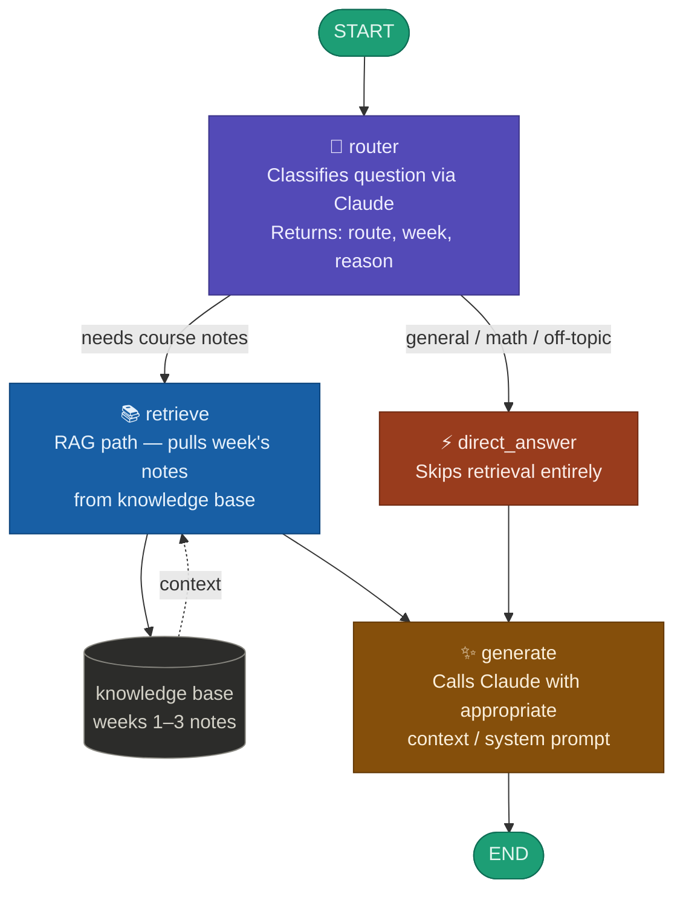

# 🧭 Graph RAG — Adaptive Question Routing Pipeline

A **LangGraph-powered** pipeline that intelligently routes student questions: either retrieving relevant course notes (RAG path) or answering directly — based on real-time classification by Claude.

---

## 🏗️ High-Level Design (HLD)



### Component breakdown

| Component | Role | Output |
|-----------|------|--------|
| `router` | Calls Claude to classify the question | `route`, `week`, `reason` (JSON) |
| `retrieve` | RAG path — fetches the relevant week's notes from the knowledge base | `context` string |
| `direct_answer` | Skips retrieval for general knowledge, math, or off-topic questions | empty `context` |
| `generate` | Calls Claude with the appropriate system prompt + context | final `answer` |

### Routing logic

```
question
   │
   ▼
router ──── "rag"    ──► retrieve ──► generate ──► answer
        └── "direct" ──► direct_answer ──┘
```

The `router` returns a JSON verdict. A **conditional edge** dispatches to either path. Both paths converge at `generate`.

---

## 📦 Installation

```bash
pip install langgraph langchain langchain-groq langchain-community duckduckgo-search python-dotenv
```

---

## ⚙️ Configuration

Create a `.env` file:

```env
GROQ_API_KEY=your_groq_api_key_here
```

Get your free API key at [console.groq.com](https://console.groq.com).

---

## 🚀 Usage

Run the pipeline with any question:

```python
result = app.invoke({
    "question": "What is the ReAct loop and how does it work?",
    "route": "", "week": None, "reason": "",
    "context": "", "answer": ""
})
print(result["answer"])
```

The pipeline automatically decides whether to retrieve course notes or answer directly.

---

## 📊 Observed run results

Actual output from a 4-question test run using `llama-3.1-8b-instant` on Groq.

### Per-question metrics

| # | Question | Route | Week | Router latency | Generate latency | Total latency | Total tokens | Accuracy |
|---|----------|-------|------|---------------|-----------------|--------------|-------------|----------|
| 1 | What did we cover in week 9? | RAG | Week 9 | 0.560s | 0.531s | 1.091s | 600 | 0.90 |
| 2 | What is 2 + 2? | DIRECT | — | 0.164s | 0.244s | 0.409s | 310 | 0.95 |
| 3 | Explain embeddings from the course notes. | RAG | Week 9 | 0.283s | 0.615s | 0.898s | 620 | 0.95 |
| 4 | Explain the attention mechanism in transformers. | RAG | Week 8 | 0.211s | 1.253s | 1.464s | 1009 | 0.85 |

### Aggregate summary

| Metric | Value |
|--------|-------|
| Avg total latency | 0.965s |
| Avg total tokens | 635 |
| Avg accuracy score | **0.91 / 1.00** |
| RAG routes | 3 / 4 |
| Direct routes | 1 / 4 |

### Token breakdown (prompt vs completion)

| # | Router prompt | Router completion | Generate prompt | Generate completion |
|---|--------------|-------------------|----------------|---------------------|
| 1 | 227 | 26 | 76 | 271 |
| 2 | 226 | 19 | 58 | 7 |
| 3 | 226 | 33 | 75 | 286 |
| 4 | 226 | 32 | 85 | 666 |

> Completion tokens scale with answer complexity — Q4 (attention mechanism) produced 666 completion tokens vs 7 for a direct math answer.

### Accuracy scoring rubric

Accuracy is evaluated post-run by a separate LLM-as-judge call using the following rubric:

| Criterion | Weight | Description |
|-----------|--------|-------------|
| Relevance | 0–0.4 | Does the answer directly address the question? |
| Correctness | 0–0.3 | Is the information accurate? |
| Completeness | 0–0.3 | Is the answer sufficiently detailed? |

Scores range from 0.0 to 1.0. For RAG-routed questions, the judge also verifies the answer draws from the retrieved course notes.

---

## 🗂️ Project Structure

```
.
├── Graph.py               # Main pipeline (router + retrieve + direct_answer + generate)
├── langgraph_metrics.py   # Extended pipeline with latency, token and accuracy tracking
├── .env                   # API keys (not committed)
└── README.md
```

---

## 📋 Agent state schema

```python
class GraphState(TypedDict):
    question: str    # The student's question
    route: str       # "rag" | "direct"
    week: str | None # Detected week number, or None
    reason: str      # Router's reasoning
    context: str     # Retrieved notes (empty for direct path)
    answer: str      # Final generated answer
```

### Metrics dataclass (langgraph_metrics.py)

```python
@dataclass
class Metrics:
    question:               str   # Question being evaluated
    route_taken:            str   # "rag" | "direct"
    week_retrieved:         str   # Week key or None
    router_reason:          str   # Router's classification reason

    latency_router:         float # Seconds for router LLM call
    latency_retrieve:       float # Seconds for knowledge base lookup
    latency_generate:       float # Seconds for generate LLM call

    tokens_router_prompt:   int   # Prompt tokens sent to router
    tokens_router_completion: int # Completion tokens from router
    tokens_gen_prompt:      int   # Prompt tokens sent to generate
    tokens_gen_completion:  int   # Completion tokens from generate

    accuracy_score:         float # LLM-as-judge score (0.0–1.0)
    accuracy_reason:        str   # Judge's explanation
```

---

## 🔧 Customization

- **Extend the knowledge base** — add more weeks to the `COURSE_NOTES` dict
- **Swap the LLM** — replace `llama-3.1-8b-instant` with any Groq-supported model
- **Add real vector search** — replace the dict lookup in `retrieve()` with a FAISS or Chroma query
- **Add more routes** — extend the router prompt to support additional classifications (e.g. `"quiz"`, `"summary"`)

---

## 📈 Metrics tracking

`langgraph_metrics.py` wraps every node with instrumentation and adds a post-run accuracy evaluator. Run it the same way as the base pipeline:

```bash
python langgraph_metrics.py
```

The final report prints per-question and aggregate stats:

```
============================================================
  PIPELINE METRICS REPORT
============================================================

[Q1] What did we cover in week 9?
  Route taken            RAG → Week 9
  Router reason          content question about week 9
  Latency (router)       0.560s
  Latency (retrieve)     0.0ms
  Latency (generate)     0.531s
  Total latency          1.091s
  Tokens (router)        227 prompt + 26 completion
  Tokens (generate)      76 prompt + 271 completion
  Total tokens           600
  Accuracy score         0.90

────────────────────────────────────────────────────────────
  AGGREGATE  (4 questions)
────────────────────────────────────────────────────────────
  Avg total latency         0.965s
  Avg total tokens          635
  Avg accuracy score        0.91
  RAG routes                3/4
  Direct routes             1/4
============================================================
```

---

## 🛠️ Tech stack

- [LangGraph](https://github.com/langchain-ai/langgraph) — conditional graph routing
- [LangChain](https://langchain.com) — LLM interface and message types
- [Groq](https://groq.com) — fast LLM inference (LLaMA 3.1)
- `time.perf_counter` — node-level latency measurement
- LLM-as-judge — post-run accuracy scoring via a separate `evaluate_accuracy()` call

---

## 📄 License

MIT
